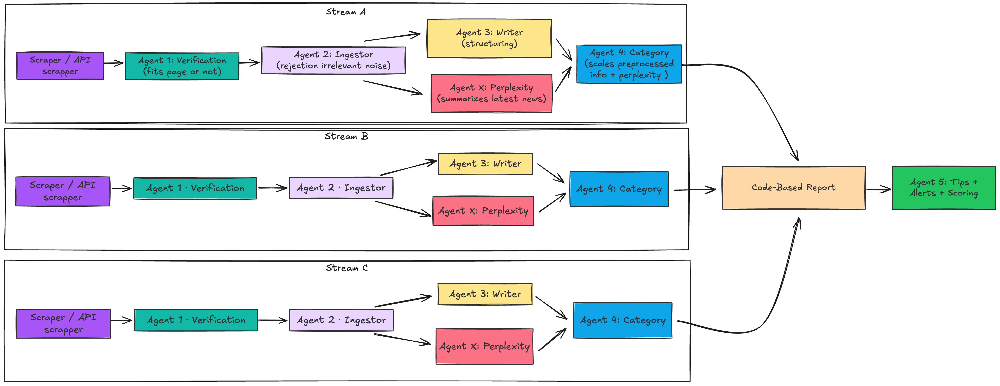

# Telecomunication Intelligence Platform

Multi-agent system for automated tracking, analysis, and reporting of Poland's telecommunications market and other avaliable information.


## Overview

This platform leverages advanced AI agents to monitor telecom industry news, extract actionable insights, and generate comprehensive market reports with tips and alerts. It combines web scraping, news aggregation, and intelligent analysis to provide real-time market intelligence.

**Key Capabilities:**
- Automated news collection from multiple sources
- AI-powered analysis and synthesis using multi-agent workflows
- Interactive report generation and visualization
- Market trend detection and verification
- Actionable tips and market alerts
- Comprehensive data storage and retrieval

---

## Multi-Agent System

The platform uses a coordinated multi-agent architecture where specialized agents handle different aspects of market analysis:

### Agent Roles

| Agent | Responsibility |
|-------|-----------------|
| **Writer Agent** | Generates market narratives and reports |
| **Keeper Agent** | Manages data storage and retrieval |
| **Perplexity Agent** | External information verification |
| **Serper Verification Agent** | Search-based fact verification |
| **Tips & Alerts Generator** | Creates actionable insights |
| **Final Summarizer** | Synthesizes comprehensive reports |



---

## Project Structure

### Backend (`/backend`)
Core Python application handling data processing and AI orchestration.

```
backend/
├── main.py                 # FastAPI application entry point
├── agents/                 # Multi-agent system
│   ├── workflow.py        # Agent orchestration & coordination
│   ├── writer_agent.py    # Content generation
│   ├── keeper_agent.py    # Data management
│   ├── final_summarizer_agent.py  # Report synthesis
│   └── ...                # Additional specialized agents
├── api/
│   └── routes.py          # REST API endpoints
├── services/              # Business logic layer
│   ├── config.py          # Configuration management
│   ├── database_*.py      # Database abstraction layers
│   ├── llm_service.py     # LLM integrations
│   ├── scraper_service.py # Web scraping orchestration
│   ├── http_client.py     # HTTP utilities
│   └── ...
├── rag/                   # Retrieval-Augmented Generation
│   ├── index_builder.py   # Vector index creation
│   ├── retriever.py       # Document retrieval system
│   └── mock_input.json
├── workflows/             # High-level workflow definitions
│   └── main_workflow.py   # Primary data processing pipeline
└── logs/                  # System logs & generated reports
```

### Frontend (`/ui`)
Modern Next.js application for data visualization and interaction.

```
ui/
├── app/                   # Next.js app directory
│   ├── page.tsx          # Homepage
│   └── reports/          # Report viewing interface
├── components/            # React components
│   ├── ui/               # Reusable UI components
│   ├── domain-synthesis.tsx      # Market analysis display
│   ├── tips-alerts.tsx           # Insights & alerts
│   ├── reports-table.tsx         # Report listing
│   └── ...
├── hooks/                 # Custom React hooks
├── styles/                # Global styles & Tailwind config
└── lib/
    └── utils.ts          # Utility functions
```

---
